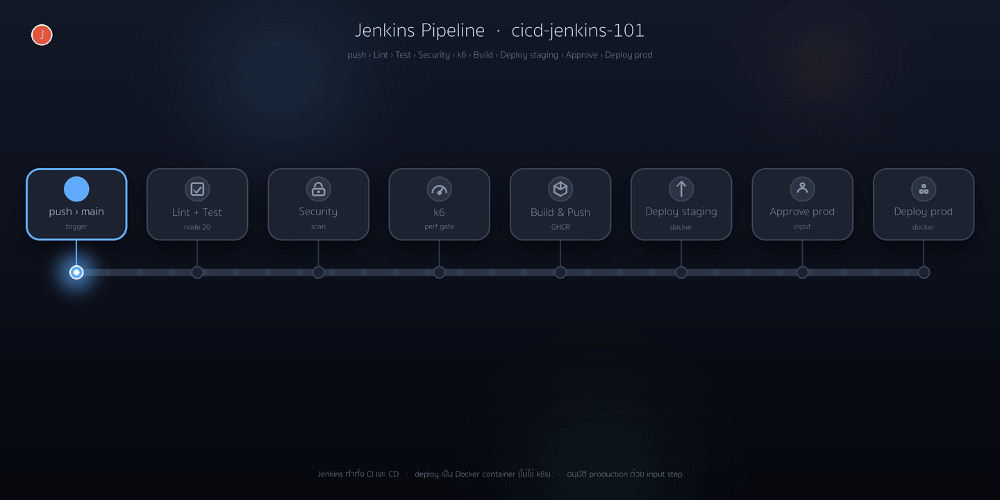

# cicd-jenkins-101

`cicd-jenkins-101` เป็นโปรเจกต์ตัวอย่าง (demo) ที่สาธิต **CI/CD pipeline ด้วย
Jenkins แบบไม่ใช้ Kubernetes** — Jenkins ทำทั้งฝั่ง **CI** (build / test / scan)
และฝั่ง **CD** (deploy แอปเป็น **Docker container** ด้วย `docker compose`)
ครอบคลุมตั้งแต่การ commit โค้ดไปจนถึงการนำขึ้นใช้งานบน production ประกอบด้วย
ด่านตรวจสอบคุณภาพ, การสแกนความปลอดภัยของ supply chain, การทดสอบประสิทธิภาพ
ด้วย k6 และด่านอนุมัติ production โดยบุคคล

> **repo คู่กัน:** [**cicd-gitops-101**](https://github.com/PonPond/cicd-gitops-101)
> ใช้ **GitHub Actions** + **ArgoCD บน Kubernetes** (GitOps / pull-based) — ส่วน
> repo นี้ตั้งใจทำให้**ไม่มี Kubernetes เลย**: Jenkins deploy เป็น Docker
> container ตรง ๆ เป็นตัวอย่าง delivery แบบดั้งเดิมที่องค์กรใช้กันมานานบนแอปชุดเดียวกัน

ตัวแอปพลิเคชันถูกออกแบบให้เรียบง่ายโดยตั้งใจ เนื่องจากจุดสำคัญของโปรเจกต์นี้อยู่ที่
**delivery pipeline** มิใช่ตัวแอปพลิเคชัน

<p align="center">
  
  <br><sub>Jenkins ทำทั้ง CI และ CD — แต่ละ stage ผ่านแล้วติด ✓ เขียว มีด่าน Approve ก่อนขึ้น production</sub>
</p>

## ภาพรวม pipeline

```
push เข้า main ─▶ Jenkins job "cicd-jenkins-101"
   Lint ─▶ Test ─▶ Security (npm audit + Trivy) ─▶ k6 perf gate
        ─▶ Build & Push image (GHCR + Trivy image scan)
        ─▶ Deploy to staging  (docker compose up → container :3001)

job "promote-to-production" (สั่งเอง) ─▶ input อนุมัติ ─▶ Deploy to production (container :3002)
```

ฝั่ง CD ไม่มี Kubernetes — Jenkins ใช้ docker socket รัน `docker compose up` ให้แอป
ทำงานเป็น container โดยตรง (staging กับ production เป็นคนละ container / คนละพอร์ต)

## เจาะลึกแต่ละขั้น (อ้างอิงไฟล์จริง)

ทั้งหมดนิยามไว้ใน [`Jenkinsfile`](Jenkinsfile) และ
[`jenkins/Jenkinsfile.promote`](jenkins/Jenkinsfile.promote)

### ขั้นที่ 1 — Lint / Test / Security / k6 (ด่านคุณภาพ)

- **Lint** และ **Test** รันในคอนเทนเนอร์ `node:20` ผ่าน `npm ci` → `npm run lint` และ `npm run test:ci`
- **Security** ทำงาน 2 อย่างแบบขนาน (`parallel`):
  - `npm audit --omit=dev --audit-level=high` — ตรวจ dependency ที่ใช้งานจริง
  - **Trivy** สแกนไฟล์ (`fs`) ที่ระดับ `HIGH,CRITICAL`
- **k6 perf gate** — build image แล้วรันใน container จริง, รอ `/readyz` พร้อม จากนั้นรัน k6 `smoke` และ `load` (ไม่ผ่านหากค่า p95 หรืออัตรา error เกิน SLO)

### ขั้นที่ 2 — Build & Push (สร้าง artifact)

- คำนวณ **tag = `sha-` ตามด้วย 7 อักขระแรกของ commit** (เช่น `sha-abc1234`)
- `docker login ghcr.io` ด้วย credential `github-pat` แล้ว build จาก `app/` และ push 2 tag (`:sha-xxxxxxx`, `:latest`)
- **Trivy** สแกน image ที่เพิ่ง push (`HIGH,CRITICAL`) หากพบช่องโหว่จะไม่ปล่อยต่อ

### ขั้นที่ 3 — Deploy to staging (CD เป็น Docker container)

- ใช้ [`deploy/docker-compose.yml`](deploy/docker-compose.yml) สั่ง `docker compose up -d` ให้แอป
  ทำงานเป็น container ชื่อโปรเจกต์ `cicd-jenkins-101-staging` ( map ออกพอร์ต `3001`)
- จากนั้น **health check** ด้วยการยิง `GET /healthz` ผ่าน network ของ compose — ไม่ผ่านถือว่า deploy ล้มเหลว

### ขั้นที่ 4 — Promote ขึ้น production (โดยบุคคล)

- job แยกชื่อ `promote-to-production` (สั่งงานเอง พร้อมระบุ `IMAGE_TAG` ที่ผ่าน staging แล้ว)
- มีด่าน **`input`** ให้กดอนุมัติก่อน — pipeline จะหยุดรอจนกว่าจะมีคนกด Promote
- เมื่ออนุมัติแล้ว `docker compose up -d` ชุด `production` (พอร์ต `3002`) + health check

### ขั้นที่ 5 — กรณี production เกิดปัญหา: rollback

- รัน job `promote-to-production` อีกครั้งด้วย `IMAGE_TAG` ของเวอร์ชันเดิมที่ดีอยู่ → Jenkins รัน container เก่าทับ
- ไม่ต้อง build ใหม่ เพราะ image เดิมยังอยู่ใน GHCR (และยังอยู่ในเครื่องที่ deploy)

## เปรียบเทียบกับเวอร์ชัน Kubernetes/GitOps

แอป / ชุดทดสอบ / ด่านคุณภาพ เหมือนกันทั้งสอง repo ต่างกันที่ "deploy ไปที่ไหน และอย่างไร"

| หัวข้อ | repo นี้ — Jenkins + Docker | [cicd-gitops-101](https://github.com/PonPond/cicd-gitops-101) — Actions + ArgoCD |
| --- | --- | --- |
| ตัวสั่ง CI | Jenkins (`Jenkinsfile`) | GitHub Actions (`.github/workflows`) |
| ปลายทาง deploy | **Docker container** (host ธรรมดา) | **Kubernetes** cluster |
| ตัว deploy (CD) | Jenkins สั่ง `docker compose` เอง | ArgoCD ดึง manifest จาก git |
| โมเดล deploy | push-based | pull-based (GitOps) |
| ต้องมี Kubernetes | **ไม่ต้อง** | ต้องมี (kind/k8s) |
| ด่านอนุมัติ production | `input` step | GitHub Environment reviewers |
| config ระบบ CI | **JCasC** + Job DSL ([`jenkins/`](jenkins/)) | ไฟล์ workflow |

## การรัน Jenkins บนเครื่อง

**ต้องมี:** Docker (Docker Desktop), `make`

```bash
make jenkins-up        # ยก Jenkins → http://localhost:8088  (admin / admin)
make jenkins-logs      # ดู log ระหว่างบูต (ครั้งแรกโหลด plugin สักครู่)
make jenkins-down      # ปิด
```

JCasC จะสร้าง job ให้อัตโนมัติ 2 ตัว: `cicd-jenkins-101` (CI/CD หลัก) และ `promote-to-production`

> **credential ที่ต้องตั้ง** (Manage Jenkins → Credentials):
> - `github-pat` — GitHub PAT (scope `write:packages`) สำหรับ push image ขึ้น GHCR
>   *(ตั้งผ่าน env ได้: `GH_TOKEN=ghp_xxx make jenkins-up`)*
>
> ขั้น Lint / Test / Security / k6 รันได้ทันที · Build & Push ต้องมี `github-pat`
> · ขั้น Deploy ใช้ docker socket ที่ mount ให้แล้ว (**ไม่ต้องมี kubeconfig / cluster**)

## โครงสร้างโปรเจกต์

```
app/                  Node (Express) service + เทส + Dockerfile
tests/k6/             k6 smoke / load / stress (ใช้ SLO threshold ร่วมกัน)
deploy/
  docker-compose.yml  deploy spec — รันแอปเป็น Docker container (staging/production)
Jenkinsfile           CI/CD หลัก (lint → test → security → k6 → build → push → deploy staging)
jenkins/
  Jenkinsfile.promote โหมด promote production (มี input อนุมัติ)
  docker-compose.yml  ยก Jenkins บนเครื่อง
  Dockerfile          Jenkins controller + docker CLI + docker compose
  casc.yaml           Jenkins Configuration as Code (สร้าง job + credential)
  plugins.txt         รายการ plugin
Makefile              คำสั่งสำหรับ dev, k6, deploy และ jenkins-up/down
```

## การจัดการแอปและ deploy (บนเครื่อง)

```bash
make install            # ติดตั้ง dependency
make test               # unit test + coverage
make docker-build       # build image cicd-jenkins-101:dev

# deploy เป็น Docker container บนเครื่อง (ไม่ต้องมี Kubernetes)
make deploy-staging     # build + รัน container staging ที่ http://localhost:3001
make deploy-production  # รัน container production ที่ http://localhost:3002
make undeploy           # หยุด/ลบ container ทั้งสอง
```

## การนำไปใช้ต่อ (fork)

manifest ตั้งค่าไว้สำหรับบัญชี **`ponpond`** (image `ghcr.io/ponpond/cicd-jenkins-101`)
หากนำไปใช้กับบัญชีของท่านเอง ให้ปรับให้ชี้มายังบัญชีของท่าน:

```bash
grep -rl ponpond . --exclude-dir=.git | xargs sed -i '' 's/ponpond/<your-username>/g'   # macOS
```

จากนั้น:

1. **สร้าง lockfile**: รัน `make install` แล้ว commit `app/package-lock.json`
2. เพิ่ม credential `github-pat` (PAT scope `write:packages`) ใน Jenkins
3. ตั้งให้ GHCR package เป็น public (หรือ `docker login` บนเครื่องปลายทาง) เพื่อให้ดึง image ได้

> **deploy ขึ้น host จริง:** ตั้ง `DOCKER_HOST=ssh://user@prod-server` แล้ว `docker compose`
> จะไป deploy บนเครื่องปลายทางให้ โดยยังไม่ต้องมี Kubernetes

## เหตุผลเชิงออกแบบ (design decisions)

- **ไม่ใช้ Kubernetes** — รันแอปเป็น Docker container ด้วย `docker compose` เป็นรูปแบบ delivery ที่เรียบง่ายและพบบ่อยในงานจริง เหมาะกับระบบที่ไม่ได้อยู่บน k8s
- **Jenkins ทำทั้ง CI และ CD** — pipeline เดียวจบตั้งแต่ build จนถึง deploy (push-based)
- **build ครั้งเดียวแล้ว promote artifact เดิม** — image ที่ผ่าน staging คือ image ตัวเดียวกับที่นำขึ้น production
- **การป้องกันแบบหลายชั้นบน supply chain** — ตรวจ dependency, สแกนไฟล์, สแกน image และใช้ runtime แบบ distroless + non-root
- **กำหนดให้ประสิทธิภาพเป็นด่านหนึ่ง** — k6 threshold ทำให้ pipeline ไม่ผ่านเมื่อ latency หรือ error เกิน SLO
- **ด่านอนุมัติโดยบุคคลก่อนขึ้น production** — `input` step หยุดรอการอนุมัติ
- **ระบบ CI เองก็เป็นโค้ด** — Jenkins ทั้งชุดนิยามด้วย JCasC + Job DSL

## สัญญาอนุญาต (License)

MIT
